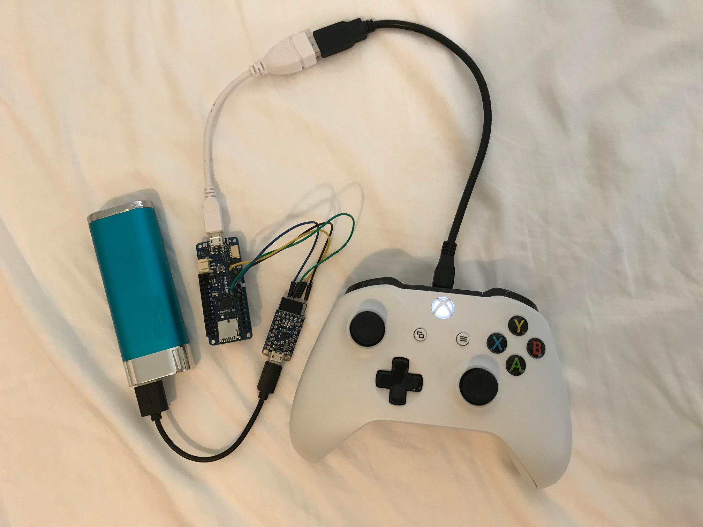

# USB Host Library SAMD
USB Host Library for Arduino SAMD boards

This library is based on the [USB Host Shield Library
2.0](https://github.com/felis/USB_Host_Shield_2.0) with modifications to work
on Arduino SAMD boards. The example programs should work on Zero, M0, and MKR
family. This uses the native USB port in USB host mode. The USB host shield
with MAX3421E is not supported by this library.

Early versions of this library required some changes to the SAMD board package.
The current version does not so it works like a regular Arduino library.



## Xbox and MKR board example

Components from left to right:

* USB phone/tablet charger, 5V
* Arduino MKR Zero (but any MKR board should work)
* Adafruit CP2104 USB to UART (but any USB 3.3V serial should work)
* Xbox One controller with batteries

USB OTG to host cable and 2 X USB micro cables are also shown. Search any
shopping website for "usb otg to usb host".

The Xbox controller must have working batteries to ensure the controller works
when both rumble motors are turned on.

When using a MKR board, in the XBOXONE.ino example program, change "Serial." to
"Serial1." to get serial console on the TX/RX pins.

When using USB host mode on MKR boards, the IDE automatic upload does not work.
When the IDE says "Uploading", double click on the MKR board reset button.

Be sure the USB serial board uses 3.3V logic levels on Tx and Rx and 5V on the
power pin.

CP2104  | MKR board
------  | ---------
5V      | VIN
GND     | GND
RXD     | 14<-TX  (Serial1)
TXD     | 13->RX  (Serial1)

The CP2104 board passes through the USB 5V to the MKR VIN power input pin. The
MKR board powers the Xbox controller via its USB port.

## MKR Boards

The Zero and M0 boards have two USB ports. The programming port is used for
sketch uploads and serial console. The native USB port with a USB OTG to host
cable/adapter is used for the USB device (for example, Xbox controller). When
using a MKR board, the native USB port is used for both.

The IDE automatic upload does not work on MKR boards when using USB host. The
solution is simple. Unplug the USB OTG to host cable/adaper, plug in the MKR
board to computer running the IDE as usual. Press the IDE Upload icon. When the
IDE status shows "Uploading", double click the MKR board reset button.


## Testing

This is unstable and may break at any time. It works for me but may not work
you. Use At Your Own Risk. Your Mileage May Vary. Batteries Not Included.

I do not have the hardware to test all the drivers. Also I do not have time to
do extensive testing. Hardware I have connected and tested minimally:

* USB keyboard and mouse
* Xbox One USB (genuine)
* PS3 USB (cheap clone)
* ftdi serial
* pl2303 serial
* cdc acm serial (Uno with 16u2)
* MIDI USB Korg NanoKontrol2

## Building the development environment

Early versions of this library required patches to the SAMD board package.
The current version does not, so it works like a regular Arduino library.

The following script works for a Linux system. The enviroment uses the [Arduino
IDE portable](https://www.arduino.cc/en/Guide/PortableIDE) feature to insulate
this project from the standard Arduino directories. This is no longer needed
since it no longer patches the SAMD board package.

The script use the IDE command line interface (CLI) which is documented
[here](https://github.com/arduino/Arduino/blob/master/build/shared/manpage.adoc).


```
IDEVER="1.8.6"
SAMDVER="1.6.19"
# Change to home directory
cd
# Create work directory
mkdir arduino_samd_usb_host
cd arduino_samd_usb_host
WORKDIR=`pwd`
# Install Ardino IDE in work directory
wget -O arduino.tar.xz https://downloads.arduino.cc/arduino-${IDEVER}-linux64.tar.xz
tar xf arduino.tar.xz -C ${WORKDIR}
rm arduino.tar.xz
# Create portable sketchbook and library directories
# Using portable prevents these changes from affecting other Arduino projects.
IDEDIR="${WORKDIR}/arduino-${IDEVER}"
LIBDIR="${IDEDIR}/portable/sketchbook/libraries"
mkdir -p "${LIBDIR}"
cd ${IDEDIR}
# Install board package
./arduino --pref "compiler.warning_level=default" --save-prefs
./arduino --install-boards "arduino:samd"
BOARD="arduino:samd:arduino_zero_edbg"
./arduino --board "${BOARD}" --save-prefs
# Install MIDI library for USBH_MIDI examples
./arduino --install-library "MIDI Library"
cd ${LIBDIR}
# Install TinyGPS for pl2303 example
git clone https://github.com/mikalhart/TinyGPS.git
# Install USB host library for SAMD
git clone https://github.com/gdsports/USB_Host_Library_SAMD
cd ${IDEDIR}
./arduino &
````
